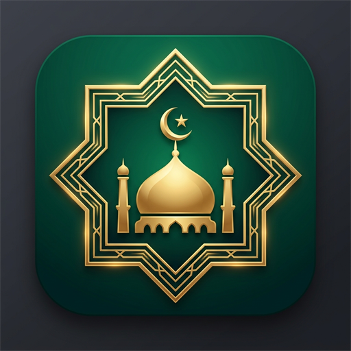
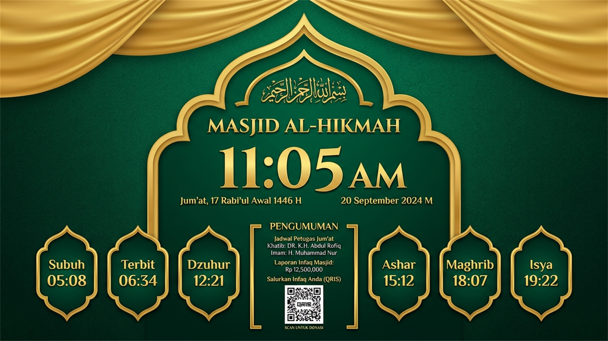
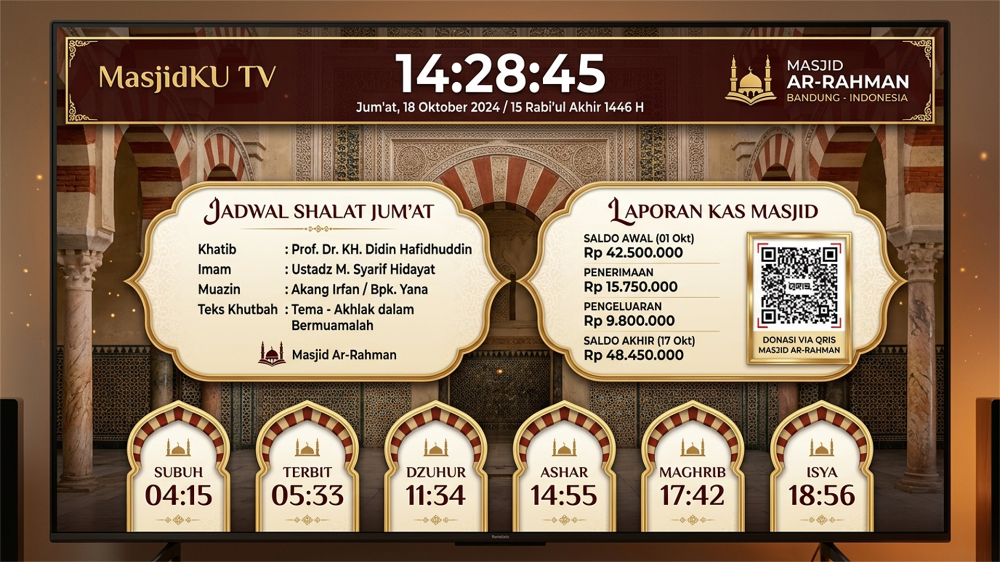
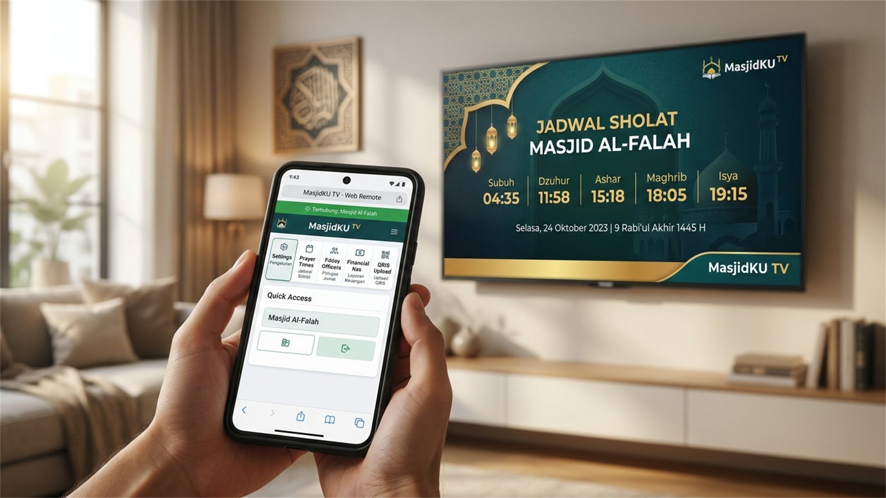
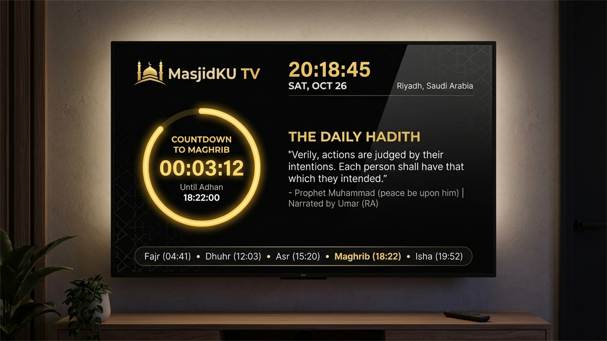

# 🕌 MasjidKU TV — Smart Digital Signage & Jadwal Sholat Android TV

<p align="center">
  
</p>

<p align="center">
  <b>Aplikasi Digital Signage & Display Jadwal Sholat Cerdas Berbasis Android TV / STB untuk Masjid & Musholla.</b><br>
  Dilengkapi Web Remote Control lokal, Multi-Kamera RTSP CCTV, Background Video/Live CCTV, YouTube Streaming, Murottal Otomatis, Laporan Kas, Petugas Jum'at, dan 6 Pilihan Tema Eksklusif.
</p>

<p align="center">
  
</p>

<p align="center">
  
  
  
  
  
  
  
</p>

---

## 📖 Daftar Isi
- [Tentang MasjidKU TV](#-tentang-masjidku-tv)
- [Fitur Utama](#-fitur-utama)
- [6 Pilihan Model Tampilan Layar (Theme Models)](#-6-pilihan-model-tampilan-layar-theme-models)
- [Web Remote Control](#-web-remote-control)
- [Tech Stack & Arsitektur](#-tech-stack--arsitektur)
- [Struktur Direktori](#-struktur-direktori)
- [Panduan Instalasi & Penggunaan](#-panduan-instalasi--penggunaan)
- [Panduan Kompilasi dari Source Code (Build from Source)](#-panduan-kompilasi-dari-source-code-build-from-source)
- [Keamanan & Konfigurasi](#-keamanan--konfigurasi)
- [Kontribusi & Lisensi](#-kontribusi--lisensi)

---

## 🌟 Tentang MasjidKU TV

**MasjidKU TV** adalah solusi modern *display informasi digital* (digital signage) masjid yang dirancang khusus untuk layar TV besar (Smart TV, Android TV, Google TV, maupun Set-Top-Box Android). 

Dengan antarmuka yang elegan, waktu sholat yang akurat berbasis koordinat GPS/Kemenag, dan sistem kontrol berbasis web (*Web Remote Control*) yang tertanam langsung di dalam perangkat, pengurus DKM dapat mengatur seluruh konten masjid (keuangan, pengumuman, petugas sholat, audio murottal, kamera CCTV, dan WhatsApp Gateway) secara praktis langsung dari browser smartphone atau laptop tanpa perlu mencolokkan keyboard/mouse ke TV.

---

## 🚀 Fitur Utama

### 1. 💬 WhatsApp Gateway & Auto-Reminder (Baru di v1.0.3!)
* **Pengingat Otomatis Petugas Jum'at**: Otomatis mengirim pesan WhatsApp ke Khotib, Imam, Muadzin, dan Bilal pada hari **Kamis (H-1)** dan **Jum'at (Hari H)** pada pukul **09:00 WIB**.
* **Pengingat Pemateri Kajian**: Tombol 1-klik dan pengingat otomatis jadwal kajian ke Ustadz / Penceramah.
* **Integrasi Fonnte API**: Cek status koneksi nomor WA, kuota pesan, dan masa aktif langsung dari Web Remote.
* **Template Pesan Dinamis**: Kustomisasi template WhatsApp dengan variabel otomatis `{nama_masjid}`, `{nama_petugas}`, `{peran}`, `{tanggal}`, `{judul_khutbah}`, `{waktu_sholat}`, dll.
* **Broadcast Manual 1-Klik**: Kirim pengingat ke seluruh petugas sholat jum'at kapan saja dengan satu sentuhan.

### 2. 🕌 Jadwal Sholat Otomatis & Presisi
* **Algoritma Perhitungan Astronomis Akurat**: Mendukung metode hisab Kemenag RI, Muslim World League (MWL), Umm al-Qura, ISNA, dll.
* **Koreksi Menit (Ihtiyat)**: Penyesuaian waktu manual (+/- menit) per jadwal sholat (Subuh, Terbit, Dhuha, Dzuhur, Ashar, Maghrib, Isya).
* **Countdown Menuju Adzan**: Tampilan hitung mundur real-time saat mendekati waktu masuk sholat.
* **Alarm Adzan & Suara Beep**: Notifikasi audio penanda waktu sholat tiba.
* **Countdown Iqomah Dinamis**: Jeda waktu iqomah yang dapat disesuaikan per waktu sholat.
* **Mode Layar Redup / Standby Sholat**: Layar otomatis meredup/gelap saat sholat berjamaah berlangsung agar tidak mengganggu kekhusyukan jamaah.

### 3. 🕒 Kustomisasi Jam Digital & Font Realtime
* **6 Pilihan Font Eksklusif**:
  * *Default System*
  * *Montserrat Bold* (Modern & Bersih)
  * *Orbitron 7-Segment* (Gaya Jam Digital Klasik)
  * *Bebas Neue* (Tegas & Berani)
  * *Cinzel Decorative* (Elegan & Klasik)
  * *Poppins* (Lembut & Kontemporer)
* **8 Preset Warna Jam**: Putih Bersih, Emas Mewah (*Gold*), Hijau Zamrud (*Emerald*), Cyan Terang, Amber Hangat, Merah Delima, Lime, dan Ungu.
* **Pilihan Format Detik & Ukuran**: Pengaturan font dan warna tersinkronisasi instan ke seluruh tema tampilan.

### 4. 📹 Multi-Kamera RTSP CCTV & Background Live (Baru di v1.0.2!)
* **Integrasi CCTV IP Camera**: Mendukung protokol RTSP harian (Tapo, Hikvision, Dahua, Ezviz, BARDI, dll) dengan audio muting dan hardware/software decoder fallback.
* **Multi-Kamera & Penjadwalan Otomatis**: Daftarkan banyak kamera CCTV dan atur agar berganti otomatis di jam-jam tertentu (misal: saat kajian, sholat, atau selepas sholat).
* **CCTV Live as Screen Background**: Jadikan siaran langsung CCTV ruang utama/mihrab sebagai wallpaper/background bergerak di belakang jadwal sholat dengan lapisan *contrast dimming* yang nyaman di mata.

### 5. 📺 YouTube Live Streaming
* Tampilkan siaran langsung kajian, tabligh akbar, siaran Mekkah/Madinah Live, atau video profil masjid langsung pada area slide media utama TV.

### 6. 📖 Pemutar Murottal 30 Juz & 50+ Qari
* **Koleksi Lengkap 114 Surah**: Dilengkapi lebih dari 50 pilihan Qari internasional dan nasional ternama (Misyari Rasyid Al-Afasy, Abdurrahman As-Sudais, Sa'ad Al-Ghamidi, dll).
* **Pemutar Otomatis Sebelum Adzan**: Atur murottal agar berputar otomatis (misal 15 menit sebelum masuk waktu Subuh/Maghrib) dan otomatis berhenti saat adzan berkumandang.

### 7. 💰 Laporan Keuangan Kas Masjid
* Menampilkan saldo kas terkini, total pemasukan, dan pengeluaran kas masjid secara transparan kepada jamaah.

### 8. 👥 Informasi Petugas Sholat Jum'at
* Menampilkan daftar nama Khotib, Imam, Muadzin, dan Bilal lengkap dengan nomor WhatsApp, tanggal pelaksanaan, dan judul khutbah.

### 9. 📢 Running Text (Teks Berjalan) & Maklumat
* Teks berjalan di bagian bawah layar untuk menyampaikan pengumuman DKM, jadwal kajian, hadits harian, dan himbauan kebersihan masjid.

### 10. 💳 QRIS Donasi & Rekening Infaq
* Menampilkan gambar barcode QRIS dan nomor rekening donasi masjid pada carousel informasi untuk memudahkan sedekah non-tunai jamaah.

### 11. 📱 Web Remote Control (Port 8080)
* Server web lokal mandiri (*embedded HTTP server*) di dalam aplikasi. Pengurus DKM cukup membuka browser di HP: `http://[IP-TV]:8080` untuk mengontrol TV secara penuh.

### 12. ⚡ 100% Offline Autonomy
* Aplikasi tetap berfungsi normal dan menghitung waktu sholat secara mandiri tanpa harus selalu terhubung ke jaringan internet.

---

## 🎨 6 Pilihan Model Tampilan Layar (Theme Models)

MasjidKU TV menyediakan 6 layout profesional yang dapat diganti kapan saja via Web Remote:

| Model | Nama Tema | Deskripsi Layout |
| :---: | :--- | :--- |
| **Model 1** | **Standard Klasik** | Layout horizontal simetris dengan kartu jadwal sholat di bagian bawah dan media carousel utama di tengah. |
| **Model 2** | **Landscape Dual Column** | Tampilan modern split-screen 2 kolom (Media slide kiri, informasi jadwal & countdown kanan). |
| **Model 3** | **Vertical Right Sidebar** | Jadwal sholat tersusun vertikal di panel sisi kanan dengan area display lebar di sisi kiri. |
| **Model 4** | **Modern Minimalist** | Desain tipografi clean dengan efek *glassmorphism* modern, sangat cocok untuk masjid perkantoran. |
| **Model 5** | **Elegant Clean** | Tampilan anggun dengan kartu transparan bernuansa *emerald green* dan aksen emas. |
| **Model 6** | **Mihrab Grand Royal** | Tampilan megah dengan ornamen lengkungan mihrab kubah islami klasik yang megah. |

### 📸 Galeri Tangkapan Layar (Screenshots)

<p align="center">
  
  
</p>
<p align="center">
  
  
</p>

---

## 📱 Web Remote Control

Tidak perlu repot menggunakan remote TV atau menghubungkan mouse. Cukup sambungkan HP/Laptop ke WiFi yang sama dengan Android TV, lalu buka browser:

```text
http://192.168.x.x:8080
```
*(Alamat IP TV ditampilkan pada layar TV di pojok atas / menu info)*

### Fitur Pengaturan Web Remote:
- 🕌 **Identitas Masjid**: Ubah nama masjid, alamat, dan logo.
- 🎨 **Tampilan & Tema**: Pilih Model 1–6, ganti background foto/video, atur durasi slide.
- 🕒 **Kustom Jam Digital**: Ganti font jam (6 preset) dan warna jam (8 preset) secara real-time.
- 📹 **Manajemen CCTV**: Tambah/edit URL RTSP, pilih kamera aktif, jadwalkan kamera, aktifkan CCTV sebagai latar belakang.
- ⏰ **Jadwal Sholat**: Atur koordinat latitude/longitude, metode hisab, dan koreksi menit.
- 🎵 **Kontrol Audio Murottal**: Putar/jeda murottal, pilih qari & surah, atur volume, dan penjadwalan pra-adzan.
- 💵 **Kas & Jum'at**: Perbarui saldo kas mingguan dan jadwal petugas Jum'at.
- 📢 **Teks Berjalan**: Edit pengumuman teks berjalan dan kecepatan scroll.

---

## 🛠️ Tech Stack & Arsitektur

* **Platform**: Android TV (Leanback / Standard Android) — `minSdk 24` (Android 7.0+) hingga `targetSdk 36` (Android 15+).
* **UI Toolkit**: [Jetpack Compose](https://developer.android.com/jetpack/compose) for Android TV (Deklaratif, reactive, modern UI).
* **Arsitektur**: Clean Architecture + MVVM (*Model-View-ViewModel*) dengan Kotlin Coroutines & `StateFlow`.
* **Streaming & Media**: [AndroidX Media3 ExoPlayer](https://developer.android.com/guide/topics/media/media3) dengan modul `exoplayer-rtsp` untuk koneksi RTSP low-latency dan fallback decoder.
* **Database**: [Room SQLite Database](https://developer.android.com/training/data-storage/room) (Schema v19) dengan KSP (*Kotlin Symbol Processing*) untuk penyimpanan lokal offline.
* **Local Web Server**: Embedded Raw HTTP Server dengan antarmuka web interaktif (HTML5, CSS3 Glassmorphism, Vanilla JS).
* **Networking**: OkHttp3, Retrofit2, Moshi JSON.
* **Build System**: Gradle Kotlin DSL (`build.gradle.kts`).

---

## 📁 Struktur Direktori

```text
MasjidKU-TV/
├── app/
│   ├── src/main/
│   │   ├── java/com/example/
│   │   │   ├── MainActivity.kt               # Entry point activity & server lifecycle
│   │   │   ├── audio/                        # Murottal & Audio Player Manager
│   │   │   ├── data/                         # Room DB (Entities, DAOs, Migrations)
│   │   │   ├── receiver/                     # Boot & Network Broadcast Receivers
│   │   │   ├── server/                       # Embedded Web Remote Server (Port 8080)
│   │   │   ├── ui/
│   │   │   │   ├── components/               # Komponen UI (Jam, Cards, Carousel, Running Text)
│   │   │   │   ├── screens/                  # Layar Tema Model 1 - 6 & Settings
│   │   │   │   └── theme/                    # Warna, Tipografi & Theme Compose
│   │   │   └── viewmodel/                    # MasjidTVViewModel (State Management)
│   │   └── res/                              # Gambar, Icon, Font, Mipmap & String Resources
│   └── build.gradle.kts                      # Konfigurasi dependensi aplikasi
├── gradle/                                   # Gradle wrapper
├── build.gradle.kts                          # Root build script
├── settings.gradle.kts                       # Project settings
└── README.md                                 # Dokumentasi proyek
```

---

## 📦 Panduan Instalasi & Penggunaan

### 1. Menggunakan File APK (Instal Langsung di TV)
1. Unduh file APK rilis (`MasjidKU-TV-v1.0.2-release.apk`).
2. Salin file APK ke Flashdisk (USB Drive) atau kirim melalui aplikasi *Send Files to TV*.
3. Buka File Manager di Android TV / STB, lalu install file APK tersebut.
4. Buka aplikasi **MasjidKU TV**.
5. Pastikan TV dan HP/Laptop terhubung pada jaringan WiFi yang sama.
6. Buka browser di HP dan akses alamat IP yang tertera pada layar TV (misal: `http://192.168.1.50:8080`) untuk mulai mengatur masjid.

---

## 💻 Panduan Kompilasi dari Source Code (Build from Source)

### Prasyarat:
* **JDK**: OpenJDK 17 atau 21 (direkomendasikan Java JBR dari Android Studio).
* **Android Studio**: Android Studio Ladybug / Koala / Hedgehog atau yang lebih baru.
* **Android SDK**: API Level 34 / 36.

### Langkah-langkah Kompilasi:

1. **Clone repositori**:
   ```bash
   git clone https://github.com/alijayanet/masjidku.git
   cd masjidku
   ```

2. **Kompilasi APK Debug**:
   * Di Windows (PowerShell):
     ```powershell
     $env:JAVA_HOME = "C:\Program Files\Android\Android Studio\jbr"
     .\gradlew.bat assembleDebug
     ```
   * Di Linux / macOS:
     ```bash
     ./gradlew assembleDebug
     ```
   * Output APK berada di: `app/build/outputs/apk/debug/app-debug.apk`

3. **Kompilasi APK / Bundle Release**:
   ```powershell
   .\gradlew.bat assembleRelease
   .\gradlew.bat bundleRelease
   ```
   * Output Release APK berada di: `app/build/outputs/apk/release/app-release.apk`
   * Output Release AAB berada di: `app/build/outputs/bundle/release/app-release.aab`

---

## 🔒 Keamanan & Konfigurasi

* **Keystore & Signing Keys**: Berkas signing key (`*.jks`, `keystore.properties`) dan variabel sensitif telah dikecualikan di `.gitignore` untuk melindungi kredensial produksi.
* **Jaringan Lokal**: Port remote web `8080` hanya dapat diakses melalui jaringan lokal (LAN/WiFi) yang sama demi keamanan perangkat di masjid.

---

## 🤝 Kontribusi & Dukungan

Kontribusi, saran perbaikan, dan pelaporan *bug* sangat kami apresiasi!
1. Fork repositori ini
2. Buat branch fitur baru (`git checkout -b fitur/FiturKeren`)
3. Commit perubahan Anda (`git commit -m 'Menambahkan fitur keren'`)
4. Push ke branch (`git push origin fitur/FiturKeren`)
5. Ajukan **Pull Request**

---

## 📄 Pengembang

Dikembangkan dengan dedikasi untuk kemakmuran masjid oleh **[Ali Jaya Net](https://github.com/alijayanet)**.

Jika aplikasi ini bermanfaat untuk masjid Anda, jangan lupa berikan bintang ⭐ pada repositori ini!
